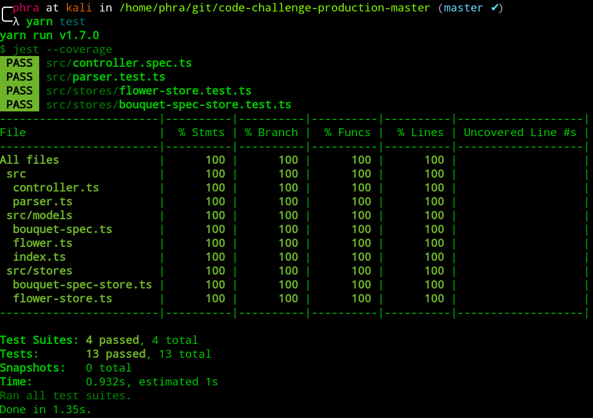

# Bloomon Code Challenge

## Implementation

See the following asciinema for an execution recording.

[](https://asciinema.org/a/nhiafLwm9ZHAlXOIf1AYIpOZW)

Codebase was migrated to TypeScript/Jest and it has a full coverage:




## Challenge description
Bloomon has a production facility that produces bouquets. We simplified how the real one -- located in Aalsmeer -- works, for the purposes of this Code Challenge:

* It takes _bouquet_ specs as input.
* It takes _flowers_ to fill its inventory as input.
* It produces _bouquets_ of different designs and sizes based on bouquet specs as output.
The _flowers_ arrive at the facility one-by-one. They are stored there until there are sufficient _flowers_ to create a _bouquet_, at which point a _bouquet_ is immediately produced.

Your job is to create an application that takes the _bouquet_ specs (the designs) and a stream of _flowers_ as inputs, and produces a stream of _bouquets_ as an output. The application must be a command line application that uses standard input and output. Use the supplied scaffold project to get up and running quickly, and feel free to add, remove or modify any of the files as needed.

The solution should be submitted in a GitHub / GitLab repository, with full source code and configuration files to run on Node.js version 8 or higher. Please add "BloomonDev" as a collaborator to have access to the repo.

Completing the challenge should take between 2 - 4 hours, and we expect a submission in the next couple of days. If you see you're exceeding the 4 hours, you should submit your solution as-is, with a short explanation of what is left and how you would finish the challenge.

### Input / output format specifications
* _Flower_ species is indicated by a single, lowercase letter:  a - z .
* _Flower_ size is indicated by a single, uppercase letter: L (large) and S (small).

**example**: a flower: rL

* _Bouquet_ name is indicated by a single, uppercase letter: A - Z .
* _Bouquet_ size is indicated by a single, uppercase letter: L (large) and S (small).


* A _bouquet spec_ is a single line of characters with the following format:

```
<bouquet name><bouquet size><flower 1 quantity><flower 1 species><f.2 quantity><f.2 species>...<f.N quantity><f.N species>
```

**example**: AL8d10r5t

* The _bouquet spec_ format includes a _bouquet_ size but no _flower_ sizes. This is because large _bouquets_ are only made from large _flowers_, and small _bouquets_ are only made from small _flowers_.
* _Flower_ species are listed in alphabetic order and only appear once in a _bouquet spec_.
* _Flower_ quantities are always greater than 0.


* The input stream will follow this structure:
```
bouquet spec1
bouquet spec2
<empty line>
flower1
flower2
flower3
...
```

**example**: 

```
AS3a4b6k
AL8d10r5t

aS
aS
bL
rL
tS
...
```

* Output should be the full _bouquet_ spec every time a _bouquet_ can be created.

**example**: AL8d7l10r5t

You can find a sample input file in the scaffold project under /sample.

### Extra task
Note: In case you want to show off and you haven't spent the 4 hours yet you can also try to tackle this one!

Our storage facility has a maximum capacity: the facility cannot store more than **256** _flowers_ at any given time. If the facility storage is full and the next _flower_ cannot be processed, the application should stop with an **exit** code of 1 and a corresponding error message.

## Set up

This project provides a scaffold that you may use to begin the challenge. Feel free to use the suggested files and code, but also feel at liberty to change anything as you see fit.

The entry point can be found at src/index.js where an input/output interface has been provided using [Readline](https://nodejs.org/api/readline.html).

In src/models, we've included some classes to serve as data structures to represent _bouquet specs_ and _flowers_. 

### Run from source

Install dependencies `npm i` and run `npm start`.

### Test

Run tests with `npm test`.

### Lint

Run linter with `npm run lint`.

## Wrap up

Are you done? Great!! Please let maria.gil@bloomon.nl know that you are ready, and she will help you with next steps. Thank you for participating in our code challenge!

